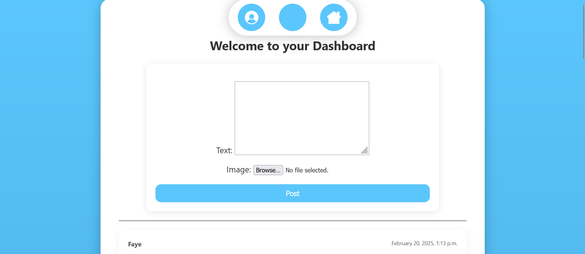
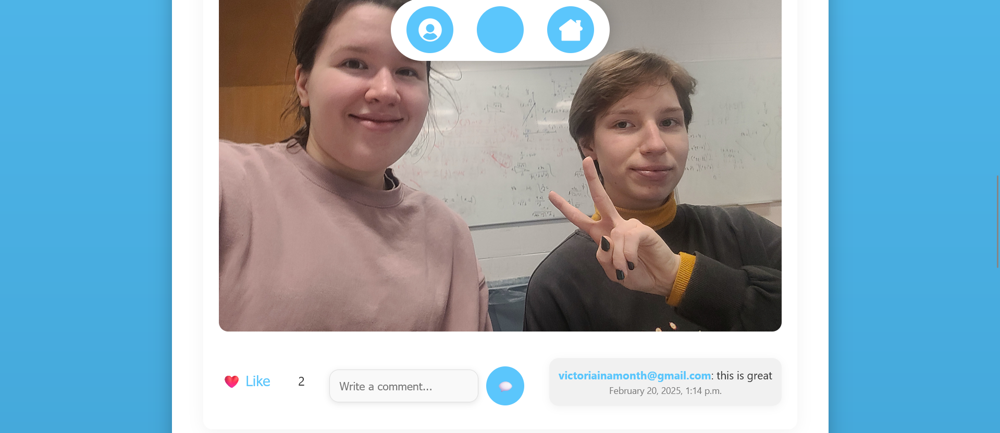
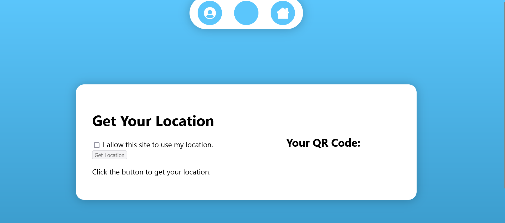
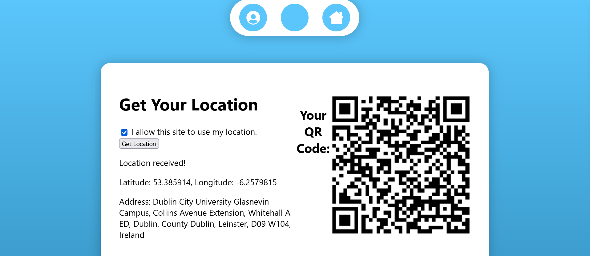
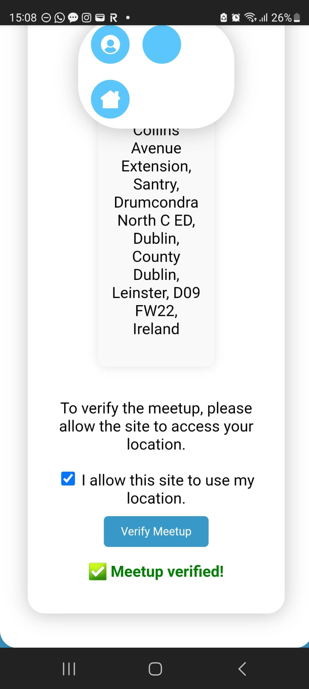
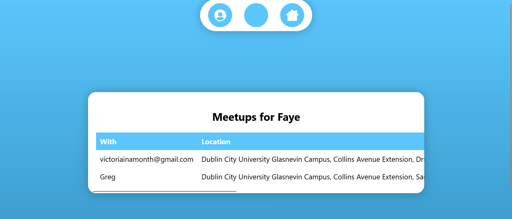
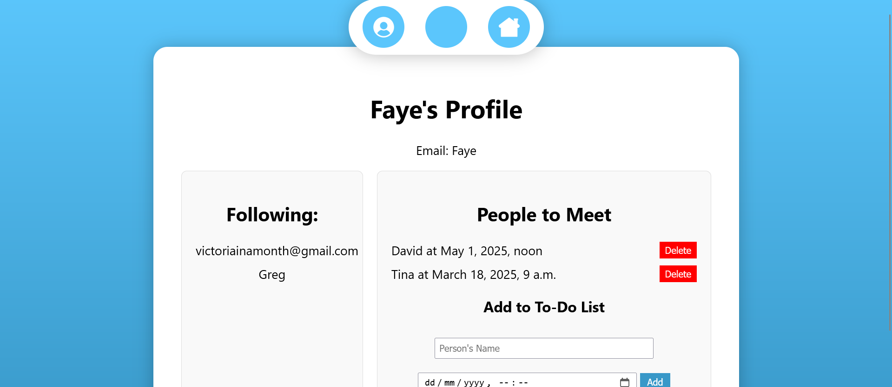

**CSC1049**  
**3rd Year Project**  
**COMSCI**

**Faye Harlick		22712251**  
**Victoria Sinko		22346993**

**User Manual**

→ Begin by accessing the application, either by hosting it locally or accessing the hosted server online at [https://urri-meetups.rb.dcu.ie/](https://urri-meetups.rb.dcu.ie/) 

→ To host locally:

- Clone the Repository with ‘git clone \[repo url\]’  
- Enter the Meetups directory which has manage.py and requirements.txt in it  
- Run ‘pip install \-r requirements.txt’  
- Run ‘python manage.py runserver’  
- Access the app at [http://127.0.0.1:8000/](http://127.0.0.1:8000/) in the browser

→ When you access the app for the first time, the landing page will appear.  

→ Click “Get started”. This will bring you to a page prompting you to either log in or register an account.  
→ If you already have a Meetups account, click “Log in”, and enter your existing account credentials.  
→ If you would like to create a new Meetups account, click “Register”, and enter your email and password  

→ Upon clicking the submit button, you will be redirected to the Meetups app. At the top of the Dashboard, you can create a post by typing some text in the box, and optionally choosing an image to post together with it. Below that, you will see a list of your own posts and your friends’ posts.  

→ If you would like to add a new friend, navigate to the ‘Log meetup’ page.  

→ Make sure your friend, who should be with you in person, is also logged in to their Meetups account.

→ On the ‘Log meetup’ page, allow the browser to access your location, and click the ‘Get location’ button. This will generate a QR code.  

→ Ask your friend to scan this code with their device camera. The app will ask them for their location to verify your proximity. 

→ The app will then add you as each other's friends, and you will be able to see each other’s posts on the dashboard.

→ You can also log subsequent meetups with your current friends, and they will be stored in the ‘Meetup history’ page.

→ On your own profile page, you can schedule future meetups with your friends, and view a list of your current friends.

